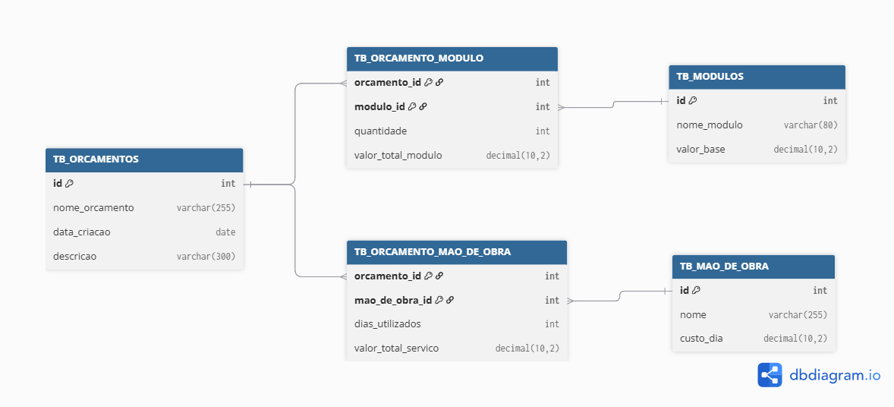

# Projeto Interdisciplinar de Banco de Dados

Este repositório contém o projeto desenvolvido para a disciplina de **Projeto Interdisciplinar de Banco de Dados** da turma de **TCC**.

---

## Autor

**Caique Cesar Lima da Silva**  
RA: 33043

---

## Descrição do Projeto

O projeto tem como objetivo modelar um sistema de **gerenciamento de orçamentos para marcenaria**, permitindo o controle de módulos, mão de obra e composição dos orçamentos.

A modelagem foi desenvolvida com base em um banco de dados relacional, utilizando o **SQLite** como sistema de gerenciamento de banco de dados.

---

## Estrutura do Repositório

PROJETOS/
│

├── diagrama_bd.png # Diagrama Entidade-Relacionamento (ER)

└── outros arquivos...

---

## 🗂️ Diagrama do Banco de Dados

Abaixo está o modelo Entidade-Relacionamento (ER) desenvolvido para o projeto:

> O diagrama apresenta as principais entidades do sistema e seus relacionamentos:
> - **TB_ORCAMENTOS**: tabela principal que armazena os orçamentos criados.  
> - **TB_MODULOS**: catálogo de módulos disponíveis com seus valores base.  
> - **TB_MAO_DE_OBRA**: cadastro de serviços e custos de mão de obra.  
> - **TB_ORCAMENTO_MODULO** e **TB_ORCAMENTO_MAO_DE_OBRA**: tabelas de junção que representam os relacionamentos N:N entre orçamentos e seus componentes.

---

## 🛠️ Tecnologias Utilizadas

- **SQLite** — Banco de dados relacional utilizado no projeto.  
- **dbdiagram.io** — Ferramenta usada para criar o modelo ER.  
- **GitHub** — Plataforma para versionamento e entrega do projeto.

